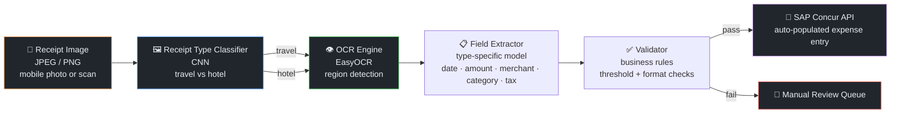
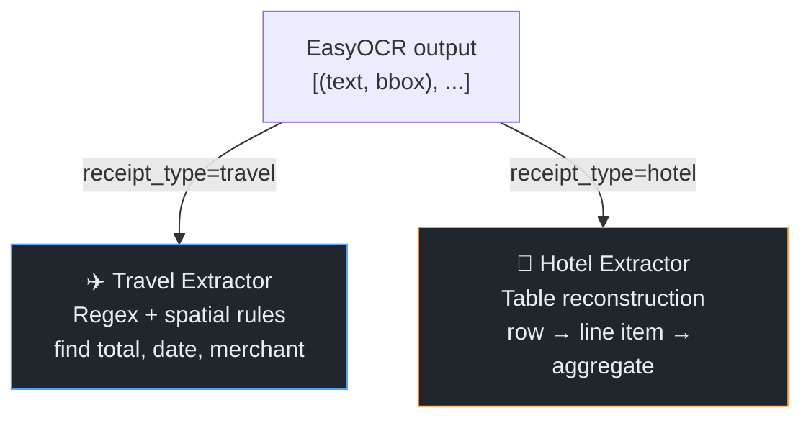

# AI4Concur — Finance Receipt Intelligence

← [Back to Portfolio](../README.md)

**Team:** Finance · Infineon Technologies  
**Timeline:** ~6 months (travel receipts → hotel receipts → stakeholder decision)  
**Role:** AI Engineer — model design, OCR pipeline, Concur API integration

---

## Problem

Finance staff processed hundreds of expense receipts monthly for SAP Concur. Each receipt
required manual reading, category assignment, and field entry (date, amount, merchant,
tax amount, currency). High volume, repetitive, and error-prone.

**Goal:** Automate receipt → SAP Concur data entry end-to-end — zero manual key entry
for standard receipt types.

---

## Pipeline Architecture

---

## Stage 1 — Receipt Type Classifier

### Why Classification First

Travel receipts and hotel receipts have **fundamentally different layouts**:

| Receipt Type | Layout Characteristics |
|-------------|----------------------|
| Travel (taxi, airline, meal) | Single-line totals, freeform merchant name, minimal structure |
| Hotel folio | Multi-line itemized charges (room rate, taxes, F&B), tabular layout, multiple date rows |

A single OCR model trained on mixed data performed poorly on hotel folios — it confused
itemized room charges with the total amount. Separating by type first allowed
type-specific extraction models.

### Model

- Architecture: **CNN image classifier** (lightweight, < 5MB)
- Input: receipt image (resized, normalized)
- Classes: `travel` / `hotel` / `unknown`
- Training: ~1,000 labelled receipt images (balanced per class)
- Augmentation: rotation (±15°), brightness/contrast variation, random crop
  → simulates real-world mobile photo conditions (angle, lighting)

---

## Stage 2 — OCR & Field Extraction

### OCR Approach

**EasyOCR** used for text detection + recognition. Raw OCR output is unstructured —
a flat list of (text, bounding_box) pairs. Two post-processing approaches by type:

**Travel receipt extraction:**
- Regex patterns locate total amount (currency symbol + number), date formats, merchant name (largest text block in upper region)
- Spatial rules: "total" label typically appears bottom-right; merchant top-center

**Hotel folio extraction:**
- Bounding box Y-coordinates cluster rows; X-coordinates identify columns
- Table reconstruction: group OCR tokens by Y-proximity → rows; by X-alignment → columns
- Aggregate total from itemized rows; handle multi-page folios

### Fields Extracted

| Field | Source | Notes |
|-------|--------|-------|
| Date | Regex on OCR text | Multiple date formats handled (DD/MM/YY, MM-DD-YYYY…) |
| Total amount | Spatial + regex | After tax, in original currency |
| Currency | ISO code detection | Defaults to SGD if not detected |
| Merchant name | Largest text region, upper area | Cleaned and normalized |
| Tax amount | Labeled line item | GST / VAT extraction |
| Expense category | Rule mapping from merchant type | "Taxi" → Transport; "Marriott" → Accommodation |

---

## Stage 3 — Validator

Business rule validation before Concur API write:

| Rule | Check |
|------|-------|
| Amount threshold | Amount > 0 and < configurable max (prevent OCR errors) |
| Date validity | Date is within current expense period (not future, not > 90 days old) |
| Currency supported | Currency code in Concur-supported list |
| Mandatory fields | All required Concur fields present (date, amount, merchant, category) |
| Confidence threshold | OCR confidence score for key fields above threshold |

Receipts failing any rule route to a **manual review queue** rather than silently failing.

---

## Iterations & Experiments

| Iteration | Change | Result |
|-----------|--------|--------|
| v1 | Single model for all receipt types | Hotel folio accuracy ~45% — itemized table confused with total |
| v2 | Added type classifier | Hotel accuracy → ~70%; travel accuracy maintained |
| v3 | Added spatial table reconstruction for hotel | Hotel accuracy → ~85% |
| v4 | Added OCR confidence threshold + manual queue | Removed low-confidence auto-submissions; user trust improved |
| v5 | Added hotel multi-page handling | Edge case fix for long folios spanning 2+ pages |

---

## Tech Stack

| Component | Technology |
|-----------|-----------|
| Image classification | PyTorch CNN |
| OCR | EasyOCR |
| Field extraction | Python (regex, spatial rules, table reconstruction) |
| Validator | Python business rules |
| API integration | SAP Concur REST API |
| Backend | FastAPI |
| Training infra | On-prem GPU |

---

## Outcome & Post-Mortem

**Technical outcome:** Working end-to-end pipeline covering travel and hotel receipts
with configurable validation and manual review fallback.

**Business outcome:** Finance org chose to purchase a **commercial SaaS solution** for
receipt processing. Project discontinued.

### Build-vs-Buy Post-Mortem

| Factor | Our Build | SaaS Decision |
|--------|----------|---------------|
| Accuracy | ~85% hotel, ~90% travel | SaaS advertised 95%+ |
| Maintenance burden | Internal team owns ML model lifecycle | Vendor manages model updates |
| Integration effort | Custom Concur API integration built | SaaS had native Concur connector |
| Long-term cost | Infra + engineering time | Predictable SaaS subscription |
| Our POC value | **Defined SaaS evaluation criteria** | Selected vendor based on our field extraction benchmarks |

**Key learning:** Our POC directly shaped the vendor selection — we evaluated SaaS vendors
against the same accuracy benchmarks we had built. The proof-of-concept had real business
value even without becoming the production system.

---

## Interview Talking Points

💬 "Why build a classifier before the OCR step?"

> "Hotel folios are structurally different from travel receipts — they have multi-row
> itemized charges laid out as tables, while travel receipts are mostly freeform single
> totals. When we tried one model for both, hotel folio accuracy was around 45% because
> the model would pick up a room rate line item as the total. By classifying receipt type
> first and routing to type-specific extraction logic, hotel accuracy jumped to ~85%.
> The classifier itself was lightweight — a small CNN — so the latency cost was minimal."

💬 "How did you handle OCR errors?"

> "Two layers. First, confidence scores — EasyOCR returns a confidence value per text region.
> We set a minimum threshold on key fields like amount and date. If confidence was below that,
> the receipt went to manual review rather than an auto-populated Concur entry. Second, a
> business rules validator — amount must be positive and below a configurable max (to catch
> OCR misreads like '5,000' being read as '50,00'), date must be in the current expense window,
> and all mandatory Concur fields must be populated. The manual review queue was designed
> to be the safety net, not an afterthought."

💬 "The project was superseded by SaaS — how do you frame that?"

> "The SaaS decision validated that the problem was worth solving commercially. What I'd change
> is building the build-vs-buy analysis in at project start — total cost of ownership,
> maintenance burden, and available vendor solutions. That said, our POC had tangible value:
> we defined the accuracy benchmarks used to evaluate SaaS vendors, and the eventual
> SaaS selection was informed by our field extraction tests. The technical work wasn't wasted."

