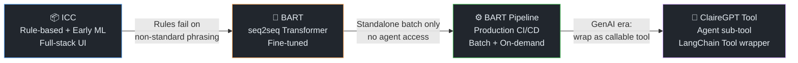
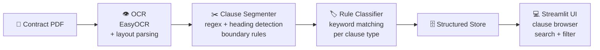
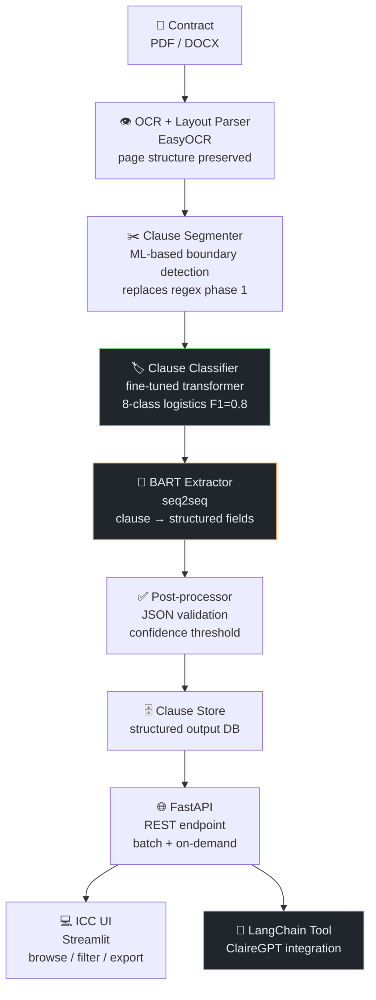
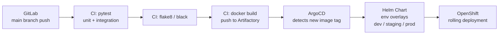

# ICC → BART — CLM Contract Clause Extraction

← [Back to Portfolio](../README.md) · [See also: ClaireGPT](clairegpt.md)

**Team:** Customer Logistics Management (CLM) · Infineon Technologies  
**Timeline:** ~3 years (ICC → BART → BART Pipeline → ClaireGPT integration)  
**Role:** Lead AI Engineer — model design, training, production pipeline, integration

---

## Problem

CLM manages hundreds of logistics contracts per cycle. Each contract contains dozens of
clauses covering liability caps, penalty terms, SLA obligations, payment conditions, and
force majeure. Manual review took **days per contract cycle** and required legal/ops expertise.

**Goal:** Automate clause-level extraction and classification so the team can query:
- "What is the counterparty's liability cap in this contract?"
- "What are the penalty terms if delivery is late?"
- "Which contracts have SLA obligations expiring this quarter?"

---

## Evolution



---

## Phase 1 — ICC (Rule-based + Early ML)

### Architecture

Full-stack application: ICC Backend (FastAPI) + ICC Frontend (Streamlit).



**Rule classifier logic:** Each clause type had a keyword signature list (e.g., liability
clauses matched on "liable", "indemnify", "loss", "damage", "cap", "limit of liability").
Clause text was checked against each signature set; highest-scoring class was assigned.

**Limitation:** Logistics contracts from different counterparties use wildly different
phrasing. Rules that worked for Carrier A failed on Carrier B's contract template.
Maintenance burden grew with each new counterparty.

---

## Phase 2 — BART (Transformer Model)

### Why BART for Clause Extraction

BART is an **encoder-decoder (seq2seq) transformer** pre-trained on denoising objectives.
For clause extraction, we framed the task as **conditional generation**:

```
Input:  "[EXTRACT LIABILITY] The aggregate liability of either party under this 
         Agreement shall not exceed the total fees paid in the preceding 12 months."

Output: {
  "clause_type": "liability",
  "party": "either party",
  "obligation": "aggregate liability cap",
  "value": "total fees paid in preceding 12 months",
  "condition": null
}
```

**Why seq2seq over span extraction (BERT QA):**

| Approach | Mechanism | Limitation |
|----------|-----------|------------|
| BERT QA (span extraction) | Finds answer span within source text | Fails when answer requires inference or paraphrase — not a literal span |
| **BART (seq2seq generation)** | Generates structured output from encoder context | Handles paraphrase, inference, multi-sentence clauses |

Clause extraction often requires **inferring** the obligation from implied language —
e.g., "shall not be liable" → `obligation: liability_exclusion`. Span extraction
cannot generate tokens not present in the source.

### Training Setup

| Aspect | Detail |
|--------|--------|
| Base model | `facebook/bart-large` |
| Fine-tuning data | CUAD-format annotated contract corpus (JSON with `label` field per clause) |
| Task framing | Seq2seq: `[CLAUSE_TYPE] {clause_text}` → structured JSON string |
| Contract types | BSA (Base Supply Agreement) and CAA (Contract Addendum/Amendment) |
| Clause topics | 8 logistics-specific topics (see below) |
| Evaluation | Per-class F1; stratified train/test split |
| Training infra | On-prem GPU node (CUDA 11.6, TensorRT 8.5) |

The project also explored a second track: **RoBERTa + custom adapter layers** for
parameter-efficient fine-tuning. Adapters allow fine-tuning only a small number of
injected parameters while the base model weights remain frozen — useful for low-data
contract topics.

### 8 Logistics Contract Topics

These topics map directly to the ICC team's operational queries:

| Topic | Operational Question |
|-------|---------------------|
| `qty_tolerance` | What quantity variance is acceptable before rejection? |
| `delivery_term` | Incoterms and delivery responsibility |
| `incoming_inspection` | Acceptance testing obligations and timelines |
| `liability_cap` | Maximum financial exposure per party |
| `order_response` | Acknowledgment and lead time obligations |
| `payment_term` | Payment due dates and late payment conditions |
| `product_change_notification` | Notice period for part/process changes |
| `warranty_period` | Defect coverage duration and remediation terms |

---

## Phase 3 — BART Pipeline (Production)

### Full Pipeline Architecture



### MLOps Pipeline



**Environment promotion:** dev → staging (manual approval) → prod. Helm value files
control resource limits, replica counts, and environment-specific config per namespace.

---

## Phase 4 — Integration as ClaireGPT Agent Tool

The BART pipeline was wrapped as a **LangChain Tool** and registered in ClaireGPT's
tool registry:

```python
# Conceptual tool wrapper (not production code)
class BARTClauseTool(BaseTool):
    name = "contract_clause_extractor"
    description = """
        Extracts structured clause data from a contract.
        Use when the user asks about contract terms, liability, SLA, penalties,
        payment conditions, or any contractual obligation.
        Input: contract_reference (str) or raw_clause_text (str)
        Output: list of {clause_type, party, obligation, value, condition}
    """
    
    def _run(self, contract_ref: str) -> dict:
        return requests.post(BART_API_ENDPOINT, json={"ref": contract_ref}).json()
```

The Planner agent decides at runtime whether to call this tool based on the user query.
For "what are the penalty terms in contract REF-2024-001?", the Planner calls the
BART tool first, then the retrieval tool for surrounding context.

---

## Key Engineering Decisions

| Decision | Alternatives | Rationale |
|----------|-------------|-----------|
| BART over BERT QA | BERT extractive QA | Clause answers often require inference beyond literal spans |
| Classify before extract | Single BART with no classifier | Type-conditioned prompts per class improved extraction quality |
| JSON-string output format | Structured prediction heads | Flexible schema; easier to add new fields without retraining output layer |
| Confidence threshold filter | Return all outputs | Low-confidence extractions flagged for human review rather than returned silently |
| Loose coupling (tool API) | Embed BART directly in ClaireGPT | Independent deployment and versioning; BART can be updated without touching ClaireGPT |

---

## Metrics

| Metric | Value |
|--------|-------|
| Clause classifier weighted F1 | 0.8 |
| Clause classes | 11 |
| Contracts processed per cycle | 100+ |
| Pipeline latency (on-demand) | < 30s per contract |
| MLOps: deployment method | GitOps (zero manual deploys) |

---

## Interview Talking Points

<details>
<summary>💬 "Why BART instead of a more modern model like GPT or LLaMA?"</summary>

> "This was built pre-GenAI era — GPT-3.5 wasn't accessible for on-prem deployment at the time.
> BART was the best available seq2seq model with strong fine-tuning properties. When we later
> had access to larger on-prem LLMs, we evaluated replacing BART with a prompted LLM approach.
> BART's advantage was determinism — the fine-tuned model was more consistent for structured
> field extraction than a prompted LLM, which occasionally hallucinated field values. For
> production clause extraction where accuracy matters, the fine-tuned BART remained more
> reliable. The LLM was used for synthesis in ClaireGPT, not for structured extraction."

</details>

<details>
<summary>💬 "How did you build the training dataset?"</summary>

> "We used CUAD-format annotation — a JSON schema where each training example has a
> clause text and a label. The CLM legal and ops team annotated a corpus of internal
> logistics contracts (BSA — Base Supply Agreements, and CAA — Contract Addendum/Amendments).
> The 8 topics — qty tolerance, delivery terms, incoming inspection, liability cap,
> order response, payment terms, product change notification, warranty — were chosen
> specifically because they're the clauses the CLM team queries most frequently in
> contract reviews. Data quality was a bigger challenge than quantity — annotators disagreed
> on borderline cases, resolved with majority voting and SME review for ambiguous examples."

</details>

<details>
<summary>💬 "What's your MLOps setup?"</summary>

> "GitLab CI/CD runs on every merge to main: unit tests, integration tests, linting,
> then builds and pushes a Docker image to Artifactory with the commit SHA as the tag.
> ArgoCD watches the Helm chart repository for new image tags and syncs to OpenShift.
> We have three environments — dev, staging, prod — each with their own Helm value
> overrides for replica count, resource limits, and environment-specific secrets.
> Promotion from staging to prod requires a manual approval step in GitLab. Zero
> manual deployments to OpenShift — everything goes through GitOps."

</details>

<details>
<summary>💬 "How did BART become a ClaireGPT tool?"</summary>

> "BART was already running as a standalone FastAPI service with a REST endpoint.
> We wrapped it as a LangChain BaseTool subclass — defining the tool name, description
> (which the LLM uses to decide when to call it), and a _run method that hits the
> BART API. The description is critical: it tells the Planner agent exactly when this
> tool is appropriate. We kept BART as a separate service rather than embedding it
> in ClaireGPT so we could update, retrain, and redeploy it independently without
> touching the agent system."

</details>
