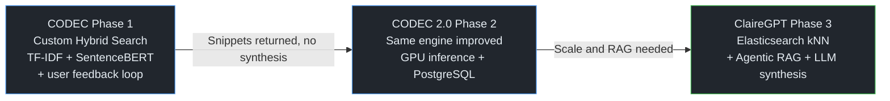
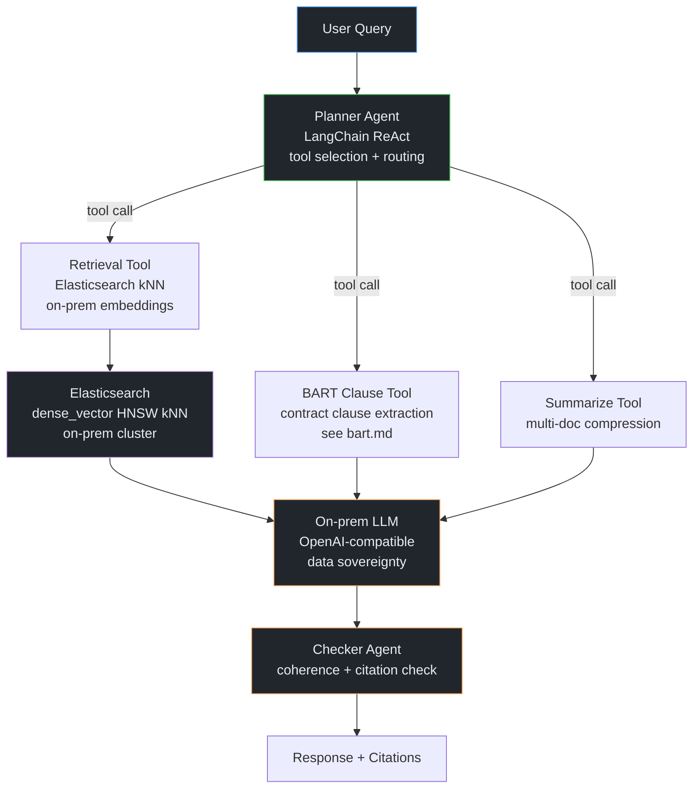
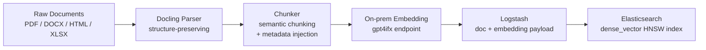

# CODEC to ClaireGPT -- CLM Knowledge Retrieval

[Back to Portfolio](../README.md)

**Team:** Customer Logistics Management (CLM) - Infineon Technologies
**Timeline:** ~2 years (CODEC to ClaireGPT)
**Role:** Lead AI Engineer -- architecture, implementation, deployment, adoption

---

## Problem

The CLM team managed 1,000+ documents: shipping policies, trade compliance guidelines,
customer SLA contracts, and process SOPs. Answering internal queries required manually
searching across multiple documents.

**Pain point:** Average query resolution time was ~2 hours. Results were raw snippets;
users had to read and synthesise across multiple documents themselves.

---

## Evolution (3 Phases)



> **Key correction from code analysis:** CODEC did NOT use Elasticsearch. It used a fully
> custom in-memory hybrid search engine (TF-IDF + SentenceBERT). Elasticsearch was only
> introduced in Phase 3 (ClaireGPT).

---

## Phase 1 -- CODEC (Custom Hybrid In-Memory Search)

**Stack:** Django + Oracle DB + SentenceBERT + TF-IDF (sklearn) + OpenShift

### Search Algorithm

No external search engine. Custom in-memory engine with two signals:

```
Query
  |-- TF-IDF vectorise (sklearn TfidfVectorizer)
  |     +-- cosine similarity vs tfidf_matrix.sav  --> tfidf_score
  |
  +-- SentenceBERT encode (sentence-transformers)
        +-- cosine similarity vs corpus_embeddings.sav  --> sbert_score

combined_score = k_coeff x sbert_score + (1 - k_coeff) x tfidf_score
```

`k_coeff` stored in DB (SearchSetting model), tunable per query-length tier (short/long).

### Supervised Learning from User Behaviour

CODEC added a **click and rating boost** on top of the hybrid score:

```python
# services.py
combined_scores = combined_scores + supv_coeffr * supv_score_rate   # user ratings
combined_scores = combined_scores + supv_coeffc * supv_score_click  # user clicks
```

- Past queries similar to the new query (by TF-IDF) were retrieved
- Documents clicked or rated on similar past queries got a score boost
- Lightweight collaborative filtering -- no model retraining required

### Corpus Coverage
- **Text search:** documents indexed per-page into PostgreSQL (`TextPerPage` table)
- **Image search:** parallel corpus for slide/diagram content (`corpus_embeddings_im.sav`)
- **Query history:** stored in `QueryView` to power the supervised boost

**Limitation:** All pickled tensors loaded in-memory at startup. Slow startup, did not
scale past ~1,000 docs. No LLM synthesis -- returned raw snippets.

### Tech Stack

| Component | Technology |
|-----------|-----------|
| Web framework | Django 4.0 |
| Keyword scoring | sklearn TF-IDF (cosine similarity) |
| Semantic scoring | sentence-transformers 2.2 (SentenceBERT) |
| Hybrid blend | Weighted sum, configurable k_coeff |
| Storage | Oracle DB (prod) / PostgreSQL / SQLite (dev) |
| Deployment | OpenShift |

---

## Phase 2 -- CODEC 2.0

Same core algorithm. Key improvements over Phase 1:

- **GPU inference:** `torch.device("cuda:0" if cuda else "cpu")` -- SentenceBERT on GPU
- **PostgreSQL migration:** away from Oracle, cloud-native
- **Better code separation:** `SearchEngine.py` extracted from Django views
- **Parameters unchanged:** still TF-IDF + SBERT hybrid with supervised boost

---

## Phase 3 -- ClaireGPT (Elasticsearch kNN + Agentic RAG)

**Goal:** Synthesise answers, not just return snippets. Multi-doc reasoning with tools.

### Why Move to Elasticsearch?

| Problem with in-memory | Solution |
|------------------------|----------|
| Tensors in memory do not scale past ~1K docs | Elasticsearch as persistent vector store |
| Corpus reload on every pod restart | Elasticsearch handles persistence and uptime |
| No synthesis -- users read raw snippets | LLM RAG synthesis layer |
| Custom engine hard to maintain | Standard Elasticsearch Python client |

### Retrieval: Elasticsearch Pure kNN

ClaireGPT uses **pure kNN** (dense vector search) -- no BM25 text hybrid:

```python
# tools/elk.py and backend/main.py
knn = {
    "field": "vector",
    "query_vector": openai_embeddings([query_text])[0],   # on-prem embedding endpoint
    "k": topN,
    "num_candidates": num_candidates
}
search_result = elastic.search(index=elk_indexname, knn=knn)
```

- **Embeddings:** on-prem OpenAI-compatible endpoint (`gpt4ifx`) -- zero external egress
- **Index field:** `vector` (Elasticsearch dense_vector type, HNSW approximate kNN)
- **Ingestion:** separate cron pipeline via Logstash (`indexing_processor.py`)

### Agent Architecture



### Ingestion Pipeline



Metadata injected per chunk: `doc_id`, `title`, `url`, `text`, `vector`, `filepath`
Ingestion is idempotent: checks if `doc_id` exists before re-indexing.

### Tech Stack

| Component | Technology | Notes |
|-----------|-----------|-------|
| Orchestration | LangChain | ReAct agent, tool registry |
| LLM | On-prem OpenAI-compatible (gpt4ifx) | Data sovereignty, no external egress |
| Embedding | On-prem gpt4ifx endpoint | Same network boundary |
| Vector store | Elasticsearch HNSW kNN | dense_vector field, pure kNN |
| Ingestion | Logstash + cron processor | Idempotent, doc-change triggered |
| Document parsing | Docling | Preserves headings, tables |
| Backend | FastAPI | Async, streaming |
| MCP server | FastMCP | MCP protocol for tool integration |
| Frontend | Streamlit | Internal UI |
| CI/CD | GitLab CI | test -> lint -> build -> push |
| Deployment | ArgoCD + Helm + OpenShift | GitOps, env-specific Helm overlays |

---

## CODEC vs ClaireGPT: What Changed

| Dimension | CODEC / CODEC 2.0 | ClaireGPT |
|-----------|------------------|-----------|
| Retrieval | TF-IDF + SentenceBERT hybrid (in-memory pickle) | Elasticsearch pure kNN (HNSW) |
| Embedding model | sentence-transformers (self-hosted) | On-prem OpenAI-compatible endpoint |
| Ranking signal | Hybrid score + click/rating boost | Dense cosine (kNN) |
| Synthesis | None -- raw snippets returned | LLM RAG synthesis |
| Agent reasoning | None | ReAct Planner -> Tools -> Checker |
| External tools | None | BART clause tool, abbreviation finder |
| Storage | Oracle/PostgreSQL + pickle files | Elasticsearch persistent vector index |
| Scale | ~1K docs (in-memory) | Scales with Elasticsearch cluster |

---

## Metrics & Outcome

| Metric | Before | After |
|--------|--------|-------|
| Average query time | ~2 hours | ~5 minutes |
| Reduction | -- | 96% |
| Daily active queries | 0 | ~100/day |
| Documents indexed | -- | 1,000+ |
| Formats supported | -- | PDF, DOCX, HTML, XLSX, PPT |

---

## Interview Talking Points

<details>
<summary>Walk me through the ClaireGPT architecture.</summary>

> "ClaireGPT is the third generation. The first two versions used a custom in-memory hybrid
> search: TF-IDF cosine similarity (sklearn) plus SentenceBERT semantic embeddings, blended
> with a configurable k-coefficient. It also had a supervised boost from user clicks and
> ratings. That was effective at the scale, but it didn't scale past ~1,000 docs and returned
> raw snippets without synthesis.
>
> ClaireGPT moved retrieval to Elasticsearch kNN -- dense_vector field, HNSW index, on-prem
> OpenAI-compatible embeddings. On top I added an agentic RAG layer: a Planner agent using
> LangChain ReAct routes queries to tools -- Elasticsearch retrieval, BART contract clause
> extraction, or a summarisation tool. An on-prem LLM synthesises the answer, and a Checker
> agent validates it against source chunks before returning."

</details>

<details>
<summary>What is the difference between CODEC and ClaireGPT retrieval?</summary>

> "CODEC used a custom hybrid: TF-IDF cosine for lexical matching plus SentenceBERT cosine
> for semantic matching, blended with a configurable k-coefficient. It also had a supervised
> component -- when a user clicked on or rated a result for a similar past query, that
> document got a score boost on future similar queries. It was reasonably sophisticated but
> built entirely from scratch. The limitation was all tensors were pickled in memory, so
> startup was slow and it didn't scale.
>
> ClaireGPT simplified retrieval to pure kNN in Elasticsearch -- dense vectors with HNSW,
> on-prem embeddings. Simpler retrieval, but scalable and persistent. The sophistication
> moved up the stack into agent orchestration and synthesis."

</details>

<details>
<summary>Why Elasticsearch over a dedicated vector DB?</summary>

> "Practical reasons. The team already ran an ELK stack for log monitoring. Operations was
> comfortable with it, it was on the approved infra list, and using Elasticsearch for
> vector search meant no new procurement cycle. The kNN support in Elasticsearch 8 was
> sufficient for our scale."

</details>

<details>
<summary>How did you handle hallucination?</summary>

> "Two approaches. First, the LLM only synthesises from retrieved chunks -- no open-ended
> generation without source context. Second, the Checker agent does a post-generation
> validation pass: it checks that key claims trace back to retrieved chunks. If not, it
> flags the response as low-confidence. Every response includes source citations."

</details>

<details>
<summary>What was the supervised learning in CODEC?</summary>

> "CODEC tracked user clicks and explicit ratings. When a new query arrived, we computed
> TF-IDF similarity between it and all past queries. For past queries above a similarity
> threshold, we retrieved which documents those users had clicked or rated, and added a
> weighted boost to those document scores for the current query. Lightweight collaborative
> filtering -- no model training needed, just score arithmetic on query history."

</details>