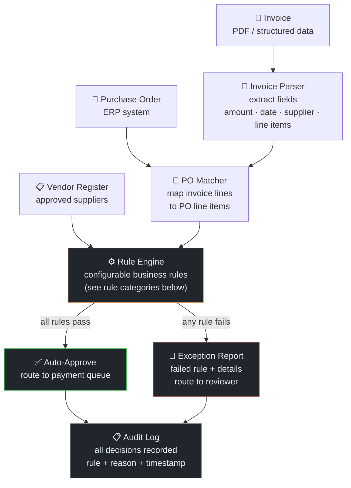
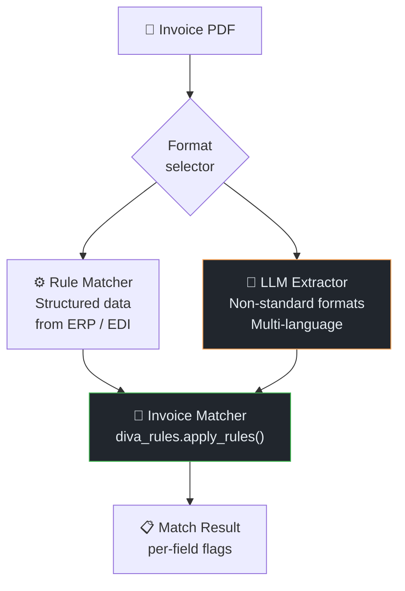

# DIVA — Finance Invoice Vouching

← [Back to Portfolio](../README.md)

**Team:** Finance (Accounts Payable) · Infineon Technologies  
**Role:** Backend Developer — rule engine design and implementation  
**Repos:** `diva` / `invoicevouching`

---

## Problem

The AP team manually vouched invoices against purchase orders before releasing payment.
Vouching involves verifying:
- Invoice amount matches PO line items (within tolerance)
- Supplier details match the approved vendor register
- Invoice date falls within the PO validity window
- Line item descriptions correspond to ordered goods/services
- Tax calculations are correct

**Volume:** Hundreds of invoices per month. Process was manual, time-consuming, and
a bottleneck for payment processing cycles.

---

## System Architecture



---

## System Architecture — Three Backend Variants

The system uses two extraction approaches, with LLM as fallback for non-standard formats:



### LLM Extraction Pipeline (`llmExtractor/extraction.py`)

Handles non-standard invoice formats (Chinese suppliers, German language, handwritten):

```
1. pymupdf   → page text (native)
2. pymupdf4llm → markdown layout (table structure)
3. pytesseract → OCR (lang: chi_tra+chi_sim+deu+eng, psm 11)
4. pdfalign  → multi-language PDF alignment

LLM Call 1: extract line-item table as CSV (semicolon delimited)
  columns: Row No.;SP No.;PCS;Amount;Unit Price;Product/Part No.;UoQ

LLM Call 2: extract header fields as JSON
  {bill_to, sold_to, currency_ISO_4217, invoice_number, ship_date, invoice_date, invoice_company}

LLM Call 3: JSON correction (secondary call to fix malformed JSON)

Currency fallback: search full PDF text for USD/CNY if LLM extracts wrong currency
```

---

## Rule Engine Design

### Matching Flags (per invoice line)

| Flag | Type | Logic |
|------|------|-------|
| `smd_flag` | Binary | Invoice line found/not found in purchasing reference data |
| `currency_flag` | Binary | Invoice currency matches reference currency |
| `quantity_flag` | Per line | Quantity deviation check |
| `price_flag` | Per line (3 values) | Mean / max / min price comparison |
| `sap_number_flag` | 4-state | -1 not found, 0 no match, 1 exact, 2 found in list |
| `date_flag` | Binary | Invoice date matches expected |
| `pos_mismatch` | Count | Position-level differences between invoice and purchasing data |

### Company Name Matching Strategy

Supplier names require fuzzy matching — abbreviations, legal suffixes (Ltd/Co./GmbH),
and romanization of Chinese names all cause exact-match failures.

```python
# ASCII company names: thefuzz fuzzy matching
score = fuzz.partial_ratio(invoice_name, ref_name)
if score >= 80:    result = "MATCH"
elif score >= 30:  result = "PARTIAL_MATCH"
else:              result = "MISMATCH"

# Non-ASCII (Chinese company names): LLM-assisted
result = match_chinese_company_gpt(invoice_name, ref_name)
```

**Threshold rationale:**
- `>= 80` catches abbreviations and legal suffix variants (Infineon Technologies Ltd ≈ Infineon Technologies)
- `30-80` flags for human review — could be a trading name or subsidiary
- `< 30` hard mismatch — different company

**LLM fallback for Chinese names:** Chinese company names have no standardized romanization,
and the same company may appear with Traditional/Simplified characters or mixed scripts.
Rule-based fuzzy matching fails here; LLM semantic comparison handles it reliably.

### Match Result Format

Each invoice comparison produces a structured flag set:

```
Invoice: INV-XXXX    Supplier: [Supplier Name]

Company Match: MATCH (score=92, method=fuzzy)    [or: PARTIAL_MATCH / MISMATCH / LLM]
Currency:      MATCH
SAP Number:    FOUND (exact match = 1)
Date:          MATCH

Line Items:
  Row 1  Qty: MATCH  Price: mean=MATCH max=MATCH min=MATCH
  Row 2  Qty: MISMATCH (+5%)  Price: mean=MATCH
  
Position Mismatch:  invoice_side=0  smd_side=1
```

Partial matches (company score 30-80) and position mismatches route to human review.

---

## Why Rule-Based (Not ML)

This was a **deliberate design decision**, not a technical limitation:

| Factor | Detail |
|--------|--------|
| **Data volume** | Limited labeled invoice-PO pairs at project start — insufficient for reliable ML classifier |
| **Error tolerance** | AP compliance has zero tolerance for silent misapprovals — deterministic rules are auditable |
| **Auditability** | Finance auditors require explainable decisions — "rule X failed with value Y" vs. "model confidence 0.73" |
| **Configurability** | Finance team can adjust tolerances (e.g., raise amount threshold during Q4 rush) without ML retraining |
| **ML baseline result** | Rule engine outperformed our early ML classifier by 15 percentage points on validation set |

**Architecture for future ML layer:**  
The rule engine was designed with an abstraction layer so an ML-based matcher could
replace or augment the line-item matching rule without changing the surrounding system.
The data generated by the rule engine (invoice + PO + pass/fail decisions) was also
structured to become ML training data once volume was sufficient.

---

## Tech Stack

| Component | Technology |
|-----------|-----------|
| Invoice parser (structured) | pandas + custom field extractors |
| Invoice parser (LLM) | pymupdf, pymupdf4llm, pytesseract, pdfalign |
| LLM extraction | On-prem LLM (table extraction + header fields + JSON correction) |
| Company matching | thefuzz (partial_ratio), LLM fallback for Chinese names |
| Rule engine | Python (diva_rules.apply_rules) |
| Reference data | ERP integration (purchasing/vendor records) |
| Backend | FastAPI |
| Containerisation | Docker |
| Audit log | Database (append-only match decisions) |
| Frontend | Streamlit (exception review UI) |

---

## Outcome

- Production deployment for Finance AP team
- Automated vouching for standard invoices (pass all rules → direct to payment queue)
- Exception handling with structured reports for edge cases
- Full audit trail for compliance

---

## Interview Talking Points

<details>
<summary>💬 "Why not use ML for invoice matching?"</summary>

> "Three reasons. First, data volume — at launch we had limited labeled invoice-reference pairs,
> which isn't enough for a reliable classifier on a problem with diverse invoice formats
> from dozens of counterparties. Second, auditability — the Finance team needs to explain
> exactly which field was mismatched and why. 'Model predicted non-match' doesn't satisfy
> a finance audit. Third, the problem is fundamentally deterministic — either the quantity
> matches or it doesn't. Rules capture that precisely. We designed the system with an
> abstraction so an ML matcher could replace the fuzzy company matching later once we
> had enough labeled examples."

</details>

<details>
<summary>💬 "How did you handle company name matching across languages?"</summary>

> "Two strategies. For ASCII names, we used fuzzy matching with thefuzz.partial_ratio —
> a score above 80 is a match, 30 to 80 routes to human review, below 30 is a mismatch.
> This handles abbreviations and legal suffix variants like 'Infineon Technologies Ltd'
> vs 'Infineon Technologies'. For Chinese company names it's a completely different
> problem — no standardized romanization, Traditional vs Simplified characters, mixed
> scripts. Fuzzy string matching completely fails here. We added an LLM-assisted comparison
> as a fallback specifically for non-ASCII names, which handled it reliably. This was
> something we only discovered after deploying to Finance teams working with Chinese
> distributors."

</details>

<details>
<summary>💬 "What was your specific contribution?"</summary>

> "I designed and implemented the rule matching backend — the per-field flag logic,
> the fuzzy company name matching with the LLM Chinese name fallback, and the LLM
> extraction pipeline for non-standard invoice formats using pymupdf and pytesseract.
> The system supports two extraction approaches: rule-based for structured EDI data,
> and LLM extraction for complex/multilingual invoices. Choosing the right approach
> per document type was a key design decision."

</details>
