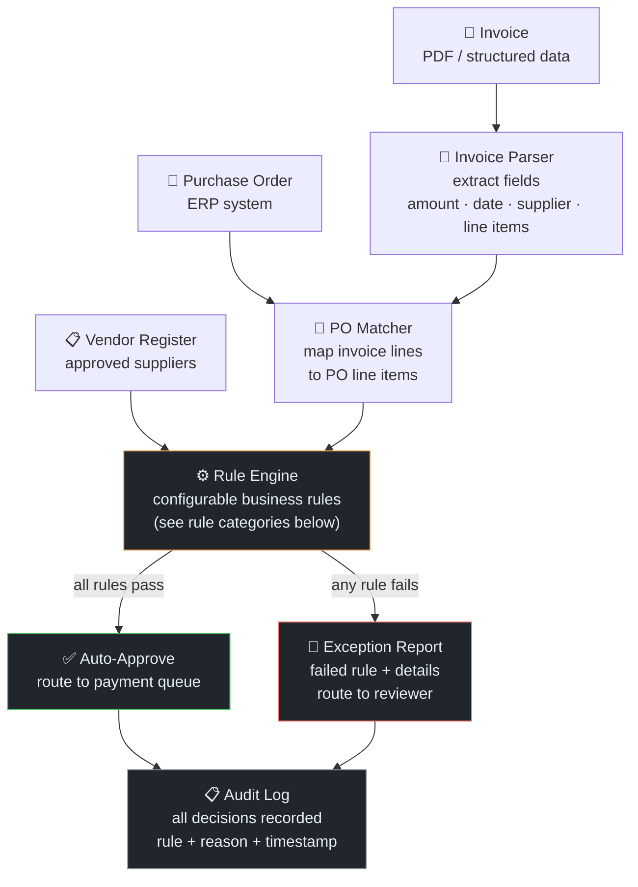

# DIVA — Finance Invoice Vouching

← [Back to Portfolio](../README.md)

**Team:** Finance (Accounts Payable) · Infineon Technologies  
**Role:** Backend Developer — rule engine design and implementation  
**Repos:** `diva` / `invoicevouching`

---

## Problem

The AP team manually vouched invoices against purchase orders before releasing payment.
Vouching involves verifying:
- Invoice amount matches PO line items (within tolerance)
- Supplier details match the approved vendor register
- Invoice date falls within the PO validity window
- Line item descriptions correspond to ordered goods/services
- Tax calculations are correct

**Volume:** Hundreds of invoices per month. Process was manual, time-consuming, and
a bottleneck for payment processing cycles.

---

## System Architecture



---

## Rule Engine Design

### Rule Categories

| Category | Rules | Configurable? |
|----------|-------|--------------|
| **Amount matching** | Invoice total vs PO total within tolerance threshold | ✅ threshold % |
| **Line item matching** | Each invoice line maps to a PO line; quantities and unit prices within tolerance | ✅ per-category tolerance |
| **Supplier validation** | Supplier ID + bank account on approved vendor register | ❌ hard check |
| **Date validation** | Invoice date within PO validity window; not post-expiry | ✅ grace period days |
| **Tax validation** | GST/VAT calculated correctly based on jurisdiction rules | ✅ rate per jurisdiction |
| **Duplicate detection** | Invoice reference not already processed (prevent double payment) | ❌ hard check |
| **Currency check** | Invoice currency matches PO currency | ❌ hard check |
| **Mandatory fields** | All required fields present (invoice no., supplier, date, amount) | ❌ hard check |

### Rule Execution Pattern

```python
# Conceptual rule engine pattern (not production code)
class RuleEngine:
    def __init__(self, config: RuleConfig):
        self.rules = [
            DuplicateCheckRule(),           # hard — immediate fail
            SupplierValidationRule(),       # hard — immediate fail
            MandatoryFieldsRule(),          # hard — immediate fail
            AmountMatchRule(config.amount_tolerance),
            LineItemMatchRule(config.line_tolerance),
            DateValidationRule(config.grace_period_days),
            TaxValidationRule(config.tax_rates),
            CurrencyCheckRule(),
        ]

    def evaluate(self, invoice: Invoice, po: PurchaseOrder) -> RuleResult:
        failures = []
        for rule in self.rules:
            result = rule.check(invoice, po)
            if not result.passed:
                failures.append(result)
                if rule.is_hard:
                    break  # hard rules short-circuit
        return RuleResult(passed=len(failures) == 0, failures=failures)
```

**Hard rules** (supplier fraud, duplicate payment) cause immediate rejection without
evaluating remaining rules. **Soft rules** (amount tolerance, date grace period)
are all evaluated and bundled into a single exception report.

### Exception Report Format

When a vouching fails, AP reviewers receive a structured exception report:

```
Invoice: INV-XXXX-XXXX
Supplier: [Supplier Name]
PO: PO-XXXX-XXXX

FAILED RULES:
[SOFT] amount_match — Invoice total SGD X,XXX deviates from PO total SGD X,XXX
       Variance: SGD XXX (3.75%) — threshold: 2.0%
       → Review if additional charges are authorized

[SOFT] line_item_match — Line 3: "Handling Fee" not mapped to any PO line item
       → Confirm if ad-hoc charge is approved
```

This format lets reviewers immediately understand what to check rather than re-reading
the full invoice from scratch.

---

## Why Rule-Based (Not ML)

This was a **deliberate design decision**, not a technical limitation:

| Factor | Detail |
|--------|--------|
| **Data volume** | Limited labeled invoice-PO pairs at project start — insufficient for reliable ML classifier |
| **Error tolerance** | AP compliance has zero tolerance for silent misapprovals — deterministic rules are auditable |
| **Auditability** | Finance auditors require explainable decisions — "rule X failed with value Y" vs. "model confidence 0.73" |
| **Configurability** | Finance team can adjust tolerances (e.g., raise amount threshold during Q4 rush) without ML retraining |
| **ML baseline result** | Rule engine outperformed our early ML classifier by 15 percentage points on validation set |

**Architecture for future ML layer:**  
The rule engine was designed with an abstraction layer so an ML-based matcher could
replace or augment the line-item matching rule without changing the surrounding system.
The data generated by the rule engine (invoice + PO + pass/fail decisions) was also
structured to become ML training data once volume was sufficient.

---

## Tech Stack

| Component | Technology |
|-----------|-----------|
| Invoice parser | Python (pdfplumber, custom field extractors) |
| Rule engine | Python (configurable rule classes) |
| PO / Vendor data | ERP system integration (REST API) |
| Config management | YAML-based rule configuration |
| Backend | FastAPI |
| Audit log | Database (append-only) |
| Frontend | Streamlit (exception review UI) |

---

## Outcome

- Production deployment for Finance AP team
- Automated vouching for standard invoices (pass all rules → direct to payment queue)
- Exception handling with structured reports for edge cases
- Full audit trail for compliance

---

## Interview Talking Points

<details>
<summary>💬 "Why not use ML for invoice matching?"</summary>

> "Three reasons. First, data volume — at launch we had limited labeled invoice-PO pairs,
> which isn't enough for a reliable classifier on a problem with diverse invoice formats
> from dozens of counterparties. Second, auditability — finance auditors need to see
> exactly which rule was violated and why. 'Model predicted non-match with confidence 0.73'
> doesn't satisfy an audit. Third, our early ML baseline actually underperformed the rule
> engine by 15 percentage points — the rules captured the structured, deterministic nature
> of the problem better than a model trained on limited data. We designed the system so
> a ML layer could be added later to handle the ambiguous cases that rules couldn't resolve."

</details>

<details>
<summary>💬 "How did you handle configurability for Finance?"</summary>

> "The rule engine reads from a YAML config file that Finance can update without a code
> deployment. Thresholds like amount tolerance percentage, grace period days for date
> validation, and per-jurisdiction tax rates are all config values. Hard rules — supplier
> fraud checks, duplicate detection — are non-configurable. This was important because
> Finance has seasonal needs: during Q4 budget close, they might raise the amount tolerance
> threshold temporarily. That's a config change, not a deployment."

</details>

<details>
<summary>💬 "What was your specific contribution?"</summary>

> "I designed and implemented the rule engine backend — the rule class hierarchy, the
> evaluation loop with hard/soft rule separation, the exception report generator,
> and the ERP API integration for fetching PO and vendor data. The frontend and
> database layer were built by other team members. I also designed the abstraction
> interface so the line-item matching rule could be replaced with an ML model
> in future without changing the surrounding rule engine."

</details>
