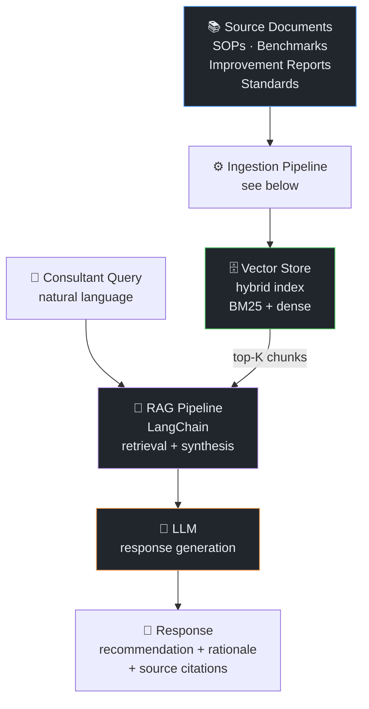
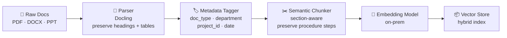

# Pro-Toolbox — Process Consultant RAG

← [Back to Portfolio](../README.md) · [Compare with: ClaireGPT](clairegpt.md)

**Team:** Process Improvement / Consultants · Infineon Technologies  
**Role:** AI Engineer — RAG pipeline design, ingestion, deployment  
**Repo:** `pro-toolbox`

---

## Problem

Process improvement consultants work across multiple business units, referencing:
- Standard Operating Procedures (SOPs)
- Process benchmarks and maturity frameworks
- Past project improvement reports and outcomes
- Industry standards and compliance requirements

**Pain point:** Finding relevant past work and applicable standards required manually
searching through shared drives and document repositories. Consultants were re-solving
problems that had already been documented elsewhere.

**Goal:** A RAG chatbot that lets consultants query across all process documentation
with synthesis — not just retrieval.

---

## How This Differs from ClaireGPT

Both systems use RAG, but the user objective drives different design choices:

| Dimension | ClaireGPT (CLM) | Pro-Toolbox (Consulting) |
|-----------|-----------------|--------------------------|
| **User objective** | Factual retrieval — "what does policy X say?" | Synthesis — "what approaches work for Y?" |
| **Document types** | Policies, contracts, SOPs | SOPs, improvement reports, benchmarks, standards |
| **Query pattern** | Lookup: specific answer exists in one doc | Analytical: answer synthesized across multiple sources |
| **Response style** | Factual answer + source citation | Recommendation + rationale + comparable examples |
| **Key challenge** | Data sovereignty, exact identifier recall | Cross-project synthesis, source attribution |
| **Agent tools** | BART clause extraction | Process comparison, gap analysis |

---

## Architecture



---

## Ingestion Pipeline

Process documents have distinct structural characteristics that required a tailored
ingestion approach:



### Metadata Tagging Strategy

Metadata is injected per document at ingestion to enable **filtered retrieval**:

| Metadata Field | Values | Used For |
|----------------|--------|----------|
| `doc_type` | SOP / benchmark / improvement_report / standard | Filter by source type |
| `department` | Finance / Logistics / Manufacturing / etc. | Department-scoped queries |
| `project_id` | Internal project reference | "Find similar to project X" |
| `date_updated` | ISO date | Recency filtering |
| `process_area` | Order-to-cash / Procure-to-pay / etc. | Process domain filtering |

Filtered retrieval example: "Show me only improvement reports from Logistics in the
last 2 years related to cycle time reduction" — metadata filters applied pre-retrieval
to narrow the search space.

### Chunking for Process Documents

Process documents have unique structure challenges:

| Document Type | Challenge | Strategy |
|---------------|-----------|----------|
| **SOP** | Numbered steps must stay together — splitting mid-procedure breaks logical context | Section-aware chunking: each procedure section (Scope, Steps, Exceptions) as a unit |
| **Improvement report** | Problem → Approach → Result narrative spans multiple paragraphs | Paragraph-grouping with overlap to preserve narrative continuity |
| **Benchmark / Framework** | Tabular maturity criteria — table rows must not be split | Table-aware chunking: entire table as one chunk with header repeated |

---

## Query Synthesis Design

Process consultant queries require **cross-document synthesis**, not single-doc lookup:

```
Query: "What cycle time reduction approaches have worked in logistics processes?"

Retrieval: 
  - Chunk from Report_2022_CLM_Improvement: "Eliminated manual PO matching → 40% cycle time reduction"
  - Chunk from SOP_[ProcessName]_v3: "Automated matching rules applied to orders above approval threshold"
  - Chunk from Benchmark_ProcessMaturity: "L3 automation: system-initiated matching for routine orders"

Synthesis prompt structure:
  "Given the following process documents, synthesize the key approaches used for 
   cycle time reduction, their results, and applicable conditions..."

Response: Synthesized recommendation with 3 approaches, results, and when each applies.
```

**Key prompt design choice:** The synthesis prompt explicitly asks the LLM to:
1. Group findings by approach type
2. Include measurable results where available
3. Note applicability conditions (when does this approach work?)
4. Cite source documents per finding

This structure produces consultant-grade output, not just a literature summary.

---

## Tech Stack

| Component | Technology |
|-----------|-----------|
| Orchestration | LangChain |
| LLM | On-prem LLM |
| Embedding | On-prem embedding model |
| Vector store | (Hybrid BM25 + dense) |
| Document parsing | Docling (structure-preserving) |
| Backend | FastAPI |
| CI/CD | GitLab CI/CD → ArgoCD → OpenShift |

---

## Outcome

- Production deployment for Process Consulting team
- Covers SOPs, benchmark frameworks, and historical improvement reports
- Consultant queries return synthesized recommendations with source attribution

---

## Interview Talking Points

<details>
<summary>💬 "How is this different from ClaireGPT if both use RAG?"</summary>

> "Same RAG foundation, very different user objective. ClaireGPT serves CLM staff doing
> factual lookups — the answer exists in a specific document and you need to find it.
> Pro-Toolbox serves consultants who need to synthesize across many sources to form a
> recommendation. A CLM user asks 'what does our contract say about liability?' — one
> right answer. A consultant asks 'what approaches have worked for reducing cycle time
> in logistics?' — the answer needs to be assembled from 5 past project reports and
> 2 benchmarks. The prompting strategy, chunking, and response structure are all
> different because the output format is different: recommendation with rationale,
> not just citation."

</details>

<details>
<summary>💬 "How did you handle document types with different structures?"</summary>

> "Metadata tagging and type-aware chunking at ingestion. SOPs have numbered step
> sequences that lose meaning if split mid-procedure, so we chunk by section boundary
> and keep all steps in a section together. Improvement reports are narrative — problem,
> approach, result — so we use paragraph grouping with overlap to preserve the story arc.
> Benchmark tables are kept as single chunks with the column headers attached so the
> LLM has the full context to interpret a maturity level. The doc_type metadata field
> at ingestion drives which chunking strategy to apply."

</details>

<details>
<summary>💬 "Why use metadata filtering instead of relying purely on semantic search?"</summary>

> "Semantic search alone has recall-vs-precision trade-offs. If a consultant asks about
> 'Logistics cycle time improvements from the last 2 years', pure dense search might
> surface a relevant-sounding Finance report from 5 years ago with higher similarity
> than a recent Logistics report. Pre-filtering by doc_type and department narrows the
> search space so the dense search operates on the right subset. It also makes the
> system more predictable — consultants can scope their queries intentionally, which
> matters for credibility of the output in a consulting context."

</details>
