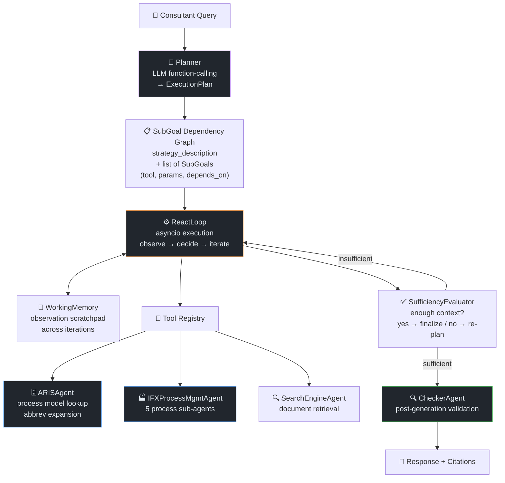
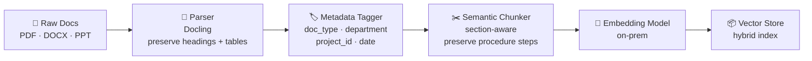

# Pro-Toolbox — Process Consultant RAG

← [Back to Portfolio](../README.md) · [Compare with: ClaireGPT](clairegpt.md)

**Team:** Process Improvement / Consultants · Infineon Technologies  
**Role:** AI Engineer — RAG pipeline design, ingestion, deployment  
**Repo:** `pro-toolbox`

---

## Problem

Process improvement consultants work across multiple business units, referencing:
- Standard Operating Procedures (SOPs)
- Process benchmarks and maturity frameworks
- Past project improvement reports and outcomes
- Industry standards and compliance requirements

**Pain point:** Finding relevant past work and applicable standards required manually
searching through shared drives and document repositories. Consultants were re-solving
problems that had already been documented elsewhere.

**Goal:** A RAG chatbot that lets consultants query across all process documentation
with synthesis — not just retrieval.

**Delivery:** Production-ready MVP delivered in **2 weeks** using spec-driven development
(**GitHub Copilot SpecKit**) — from concept to deployed application with API gateway
configuration. Knowledge sources: **ARIS, Intranet, Confluence, PRIMA**.

---

## How This Differs from ClaireGPT

Both systems use RAG, but the user objective drives different design choices:

| Dimension | ClaireGPT (CLM) | Pro-Toolbox (Consulting) |
|-----------|-----------------|--------------------------|
| **User objective** | Factual retrieval — "what does policy X say?" | Synthesis — "what approaches work for Y?" |
| **Document types** | Policies, contracts, SOPs | SOPs, improvement reports, benchmarks, standards |
| **Query pattern** | Lookup: specific answer exists in one doc | Analytical: answer synthesized across multiple sources |
| **Response style** | Factual answer + source citation | Recommendation + rationale + comparable examples |
| **Key challenge** | Data sovereignty, exact identifier recall | Cross-project synthesis, source attribution |
| **Agent tools** | BART clause extraction | Process comparison, gap analysis |

---

## Architecture — ReAct with Structured Execution Planning

Pro-Toolbox uses a **plan-then-execute** ReAct loop rather than step-by-step chain-of-thought.
The planner produces a complete `ExecutionPlan` (list of `SubGoal` objects with dependencies)
before any tool is called — this reduces back-and-forth and allows parallel sub-goal execution.



### Planner Intelligence — Process Abbreviation Expansion

Infineon consultants use process abbreviations. The planner pre-processes queries before
routing to ARIS:

```python
# Before ARIS search: expand known abbreviations + strip noise words
"who is the owner of dtc process"  →  "demand to cash"
"how to improve my p2p"            →  "purchase to pay"
"what is plan under demand to cash" →  "plan demand to cash"
```

Known mappings (12 Infineon processes): DTC, OTC, MTB, STP, PTP/P2P, RTR, HTR, FTD, I2D, D2M, M2B

### IFX Process Management Sub-Agents

For process improvement queries, the IFXProcessMgmtAgent dispatches to 5 domain sub-agents:

| Sub-Agent | Covers |
|-----------|--------|
| `change_communication_agent` | Stakeholder communication for process changes |
| `execution_stabilization_agent` | Stabilizing processes in execution phase |
| `initiation_planning_agent` | Project initiation and planning activities |
| `monitoring_control_agent` | KPI tracking, performance gates |
| `project_mgmt_agent` | General project management guidance |

### Exception Handling

| Error Type | Handling |
|------------|---------|
| Planning failure | `PlanningError` exception → fast-path fallback (direct retrieval, no planning) |
| Tool unavailable | `ToolUnavailableError` → skip sub-goal, continue with remaining |
| Citation gate fail | `CitationGateError` → re-query with citation requirement |
| Timeout | `ReactResult.timed_out=True` → return partial results |

---

## Ingestion Pipeline

Process documents have distinct structural characteristics that required a tailored
ingestion approach:



### Metadata Tagging Strategy

Metadata is injected per document at ingestion to enable **filtered retrieval**:

| Metadata Field | Values | Used For |
|----------------|--------|----------|
| `doc_type` | SOP / benchmark / improvement_report / standard | Filter by source type |
| `department` | Finance / Logistics / Manufacturing / etc. | Department-scoped queries |
| `project_id` | Internal project reference | "Find similar to project X" |
| `date_updated` | ISO date | Recency filtering |
| `process_area` | Order-to-cash / Procure-to-pay / etc. | Process domain filtering |

Filtered retrieval example: "Show me only improvement reports from Logistics in the
last 2 years related to cycle time reduction" — metadata filters applied pre-retrieval
to narrow the search space.

### Chunking for Process Documents

Process documents have unique structure challenges:

| Document Type | Challenge | Strategy |
|---------------|-----------|----------|
| **SOP** | Numbered steps must stay together — splitting mid-procedure breaks logical context | Section-aware chunking: each procedure section (Scope, Steps, Exceptions) as a unit |
| **Improvement report** | Problem → Approach → Result narrative spans multiple paragraphs | Paragraph-grouping with overlap to preserve narrative continuity |
| **Benchmark / Framework** | Tabular maturity criteria — table rows must not be split | Table-aware chunking: entire table as one chunk with header repeated |

---

## Query Synthesis Design

Process consultant queries require **cross-document synthesis**, not single-doc lookup:

```
Query: "What cycle time reduction approaches have worked in logistics processes?"

Retrieval: 
  - Chunk from Report_2022_CLM_Improvement: "Eliminated manual PO matching → 40% cycle time reduction"
  - Chunk from SOP_[ProcessName]_v3: "Automated matching rules applied to orders above approval threshold"
  - Chunk from Benchmark_ProcessMaturity: "L3 automation: system-initiated matching for routine orders"

Synthesis prompt structure:
  "Given the following process documents, synthesize the key approaches used for 
   cycle time reduction, their results, and applicable conditions..."

Response: Synthesized recommendation with 3 approaches, results, and when each applies.
```

**Key prompt design choice:** The synthesis prompt explicitly asks the LLM to:
1. Group findings by approach type
2. Include measurable results where available
3. Note applicability conditions (when does this approach work?)
4. Cite source documents per finding

This structure produces consultant-grade output, not just a literature summary.

---

## Tech Stack

| Component | Technology |
|-----------|-----------|
| Agent orchestration | Custom ReAct loop (asyncio, OpenAI function-calling) |
| Execution model | ExecutionPlan + SubGoal dependency graph |
| LLM | On-prem OpenAI-compatible endpoint (gpt4ifx) |
| Embedding | On-prem embedding model |
| Vector store | Elasticsearch (dense_vector kNN HNSW) |
| Process model | ARIS (process management system, REST API) |
| Sufficiency check | SufficiencyEvaluator (custom LLM judge) |
| Document parsing | Docling (structure-preserving headings + tables) |
| Backend | FastAPI |
| Docker registry | Artifactory |
| CI/CD | GitLab CI/CD → ArgoCD → OpenShift (dev/staging/prod) with Helm overlays |
| Dev tooling | GitHub Copilot SpecKit (spec-driven development) |

---

## Outcome

- Production-ready MVP deployed in **2 weeks** via spec-driven development (GitHub Copilot SpecKit)
- Deployed for Process Consulting team
- GitOps CI/CD pipeline explored (dev/staging/prod environments) for production-readiness
- Covers SOPs, benchmark frameworks, and historical improvement reports
- Consultant queries return synthesized recommendations with source attribution

---

## Interview Talking Points

<details>
<summary>💬 "How is this different from ClaireGPT if both use RAG?"</summary>

> "Same RAG foundation, very different user objective. ClaireGPT serves CLM staff doing
> factual lookups — the answer exists in a specific document and you need to find it.
> Pro-Toolbox serves consultants who need to synthesize across many sources to form a
> recommendation. A CLM user asks 'what does our contract say about liability?' — one
> right answer. A consultant asks 'what approaches have worked for reducing cycle time
> in logistics?' — the answer needs to be assembled from 5 past project reports and
> 2 benchmarks. The architecture also differs: ClaireGPT uses LangChain ReAct tools,
> Pro-Toolbox uses a structured ExecutionPlan where the planner produces a full dependency
> graph of sub-goals upfront — this allows parallel tool execution instead of sequential
> step-by-step."

</details>

<details>
<summary>💬 "What is the ExecutionPlan pattern and why did you use it?"</summary>

> "Standard ReAct loops are step-by-step: think → act → observe → think again. This works
> but is slow for multi-part consultant queries. Instead, our planner generates a complete
> ExecutionPlan upfront — a list of SubGoals each with a tool, parameters, and a depends_on
> list. Sub-goals without dependencies can execute in parallel. For a query like 'find the
> DTC process owner and any recent improvements', the plan generates two parallel sub-goals:
> ARIS lookup for process owner, and document retrieval for improvements. They run
> simultaneously in the asyncio loop. The SufficiencyEvaluator then decides if the
> observations are enough to answer, or if we need another planning round."

</details>

<details>
<summary>💬 "How did you handle Infineon-specific process abbreviations?"</summary>

> "Infineon has 12+ internal process abbreviations (DTC=demand-to-cash, P2P=purchase-to-pay,
> etc.) that ARIS uses as process names. If a consultant asks 'who owns the DTC process',
> a naive search for 'DTC' fails. We built a pre-processing step in the planner that
> expands known abbreviations and strips question/noise words before building the ARIS
> search query. 'who is the owner of DTC process' becomes 'demand to cash' — which
> matches ARIS correctly. This was a simple but high-impact fix that came from watching
> consultants use the system in user testing."

</details>
